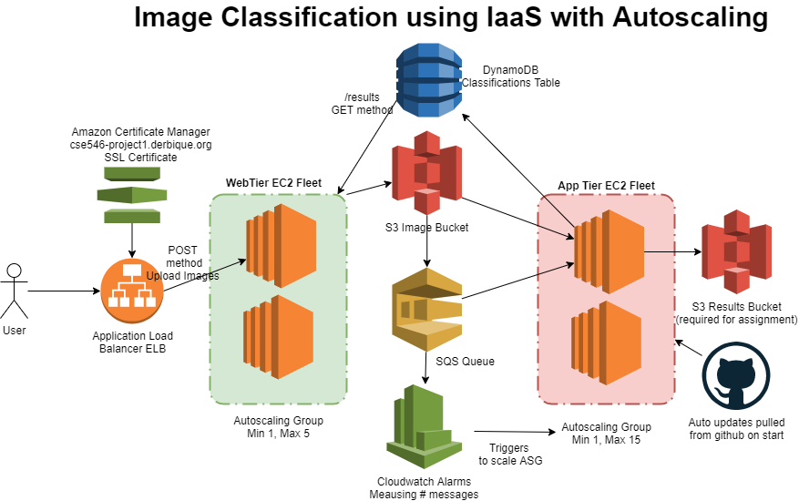

# cse546-project1
Cloud Computing Project One for ASU CSE546 Spring 21

## Contributors
- Austin Derbique
- Alexander Pappas
- Cole Ruter

## Overview
Autoscaling Application for Image Classification using Python on AWS



## Instructions for Deployment
Refer to the cloud architecture diagram for insight into how to implement this workload.
### Requirements
- IAM roles configured
- Infrastructure set up to specification of architecture diagram
- General knowledge of Python
- General knowledge of AWS

## Instructions for Starting and Stopping Workload
First, navigate to EC2 service in the `us-east-1` region.
### Starting Instances
Simply change the Autoscaling group desired capactities to one. This will instantiate at least one instance for web tier and one for app tier.
### Stopping Instances
Simply change the Autoscaling groups' desired capacities to zero. This will terminal all EC2 instances.

## Accessing Resources
### Access to Frontend
Navigate to [https://cse546-project.derbique.org](https://cse546-project1.derbique.org). This is accessible from the open internet

### Access to EC2 instances
SSH access to the EC2 instances is limited to whitelisted IP addresses defined in a Security Group. Additionally, public key autthentication is the only supported login behavior.

## Frontend behaviors
|Action|Description|Method|
|------|-----------|------|
|Choose Files|Selects the files you wish to upload. Multiselect is supported.|N/A|
|Submit|Uploads the selected files to webserver.|POST|
|Get Results|Displays all images that have currently been classified by the application.|GET|
|Reset and Clear System|Removes all objects from S3, Clears SQS queue, deletes and reinstantiates DynamoDB table.|GET|

### Manual Start Procedure
To start the webserver, log into the EC2 instance as user `ec2-user`. Then, simply execute the following commands
```
$ tmux
$ cd ~/cse546-project1/server
$ python app.py
```

If in the event that the webserver is already running and needs to be stopped, you can attach yourself to the tmux process to kill the application
```
$ tmux a
```

## Repository Directory Structure
- Note: Each component of the application has different dependencies. Each component has a requirements.txt with all requirements listed for python code to run.
### Server/
This contains code to run a Python flask web server. This configuration is what's used to run the web tier of the application.
#### Usage
```
cd cse546-project1/server
python3 app.py
```
### Classifier/
This contains code to run a Python based image classification application. 
#### Usage
```
cd cse546-project1/classifer
python3 main.py
```
### Documents/
- [Project Report](documents/cse546_project_1_report.pdf)
- [Architecture Diagram](documents/cloud_architecture.png)

